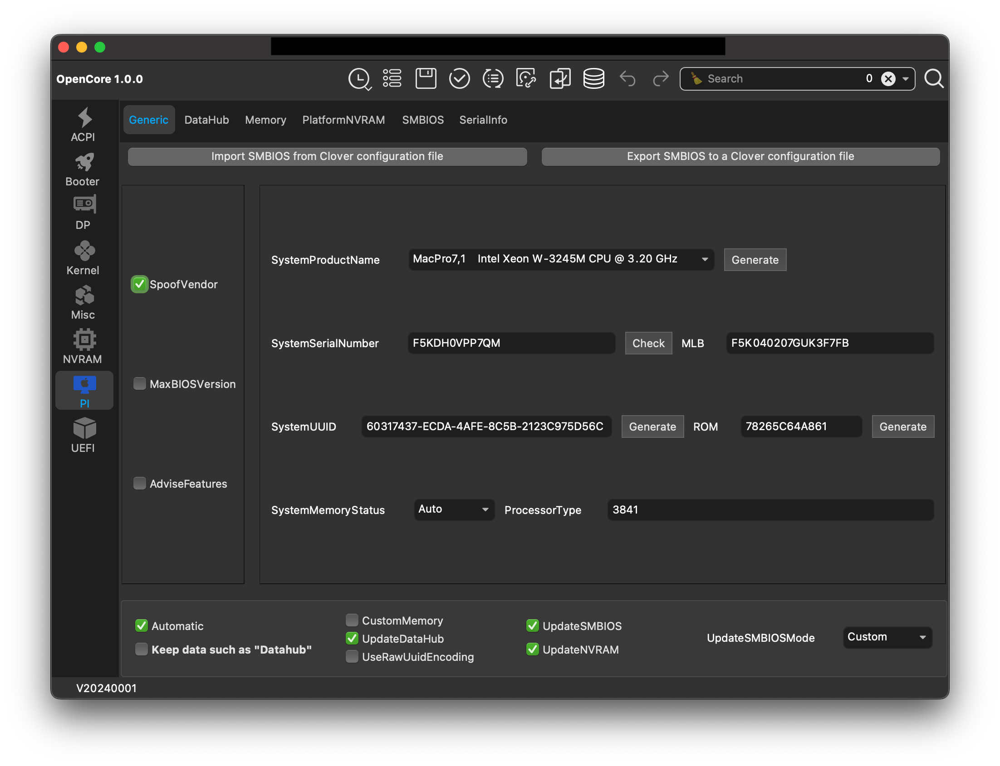
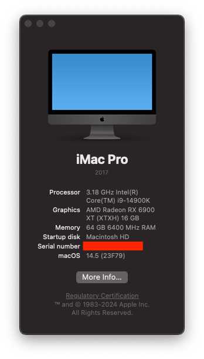
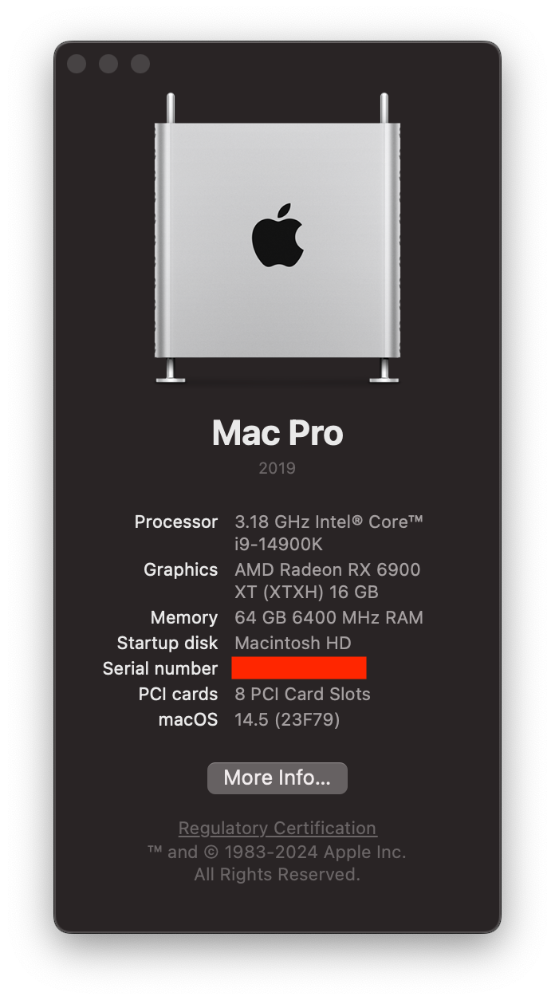
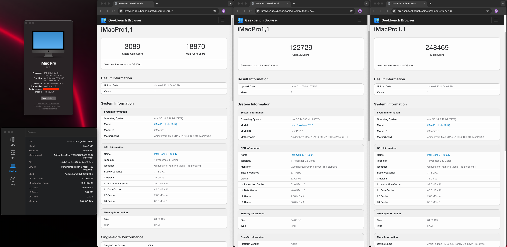
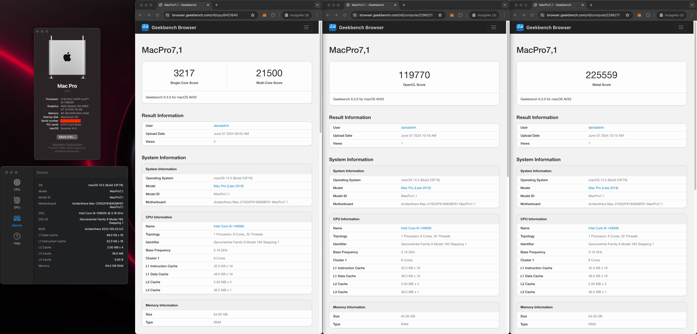
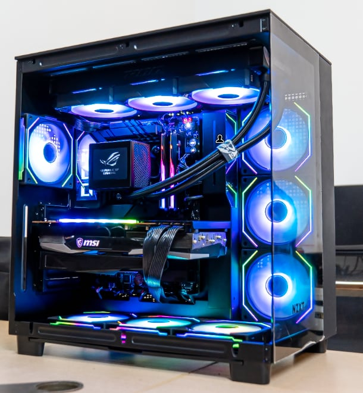

Opencore 1.0.0

<h3>MacOS Sonoma 14.5 (23F79)</h3>

<h4>Hardware</h4>
<ul>
  <li>Mainboard: Asus Maximus Z790 Dark Hero</li>
  <li>CPU: i9-14900K</li>
  <li>CPU Cooler: ROG RYUJIN III 360 ARGB</li>
  <li>Memory: G.SKILL Trident Z5 RGB 64GB 6400MHz (32GBx2) DDR5</li>
  <li>Storage (MacOS): WD_BLACK SN850X NVMe</li>
  <li>Storage (Windows 11): Samsung 990 Pro 1TB</li>
  <li>Graphics: MSI Radeon RX 6900 XT GAMING X TRIO 16G</li>
  <li>Case: NZXT H9 Flow</li>
  <li>Fan Case: Lian Li UNI Fan SL 120 x7</li>
  <li>Monitor: Asus TUF Gaming VG34VQL3A 2K</li>
  <li>Keyboard: Gray Studio Space65 III</li>
  <li>Mouse: Logitech Lightspeed G703 Hero</li>
</ul>

<h4>BIOS</h4>
<ul>
    <li>Disable PPT</li>
    <li>OS Type: Other OS</li>
</ul>

<h4>Feature</h4>
<ul>
  <li>Most feature work fine (exclude Airdrop and Wi-Fi)*</li>
  <li>Bluetooth working with default Intel card</li>
  <li>USB: All port work find (include case port)</li>
</ul>
<i>* In order for continuity functions (such as Airdrop and Wi-Fi) to work, you will need to replace stock Intel wireless adapter with M.2 A+E macOS native support adapter.</i>

<strong>Note: </strong>Before using this EFI, regenerate the Platform Info to prevent conflict with other users,
include

<ul>
  <li>System Serial Number</li>
  <li>MBL</li>
  <li>System UUID</li>
  <li>ROM</li>
</ul>

I'm using  <a href="https://github.com/ic005k/OCAuxiliaryTools">OCAuxiliaryTools</a>

<h4>Geekbench 6</h4>
<ul>
  <li>
    iMac Pro 1,1 (not use CpuFriend.kext)
    <ul>
      <li><a href="https://browser.geekbench.com/v6/cpu/6361367">CPU: Single-Core: 3089, Multi-Core: 18870</a></li>
      <li><a href="https://browser.geekbench.com/v6/compute/2277745">GPU (OpenCL): 122729</a></li>
      <li><a href="https://browser.geekbench.com/v6/compute/2277753">GPU (Metal): 248469</a></li>
    </ul>
  </li>
  <li>
    Mac Pro 7,1 (optimize CPU performance by using CpuFriend.kext, CPUFriendDataProvider.kext and CpuTopologyRebuild.kext)
    <ul>
      <li><a href="https://browser.geekbench.com/v6/cpu/6421640">CPU: Single-Core: 3217, Multi-Core: 21500</a></li>
      <li><a href="https://browser.geekbench.com/v6/compute/2298221">GPU (OpenCL): 119770</a></li>
      <li><a href="https://browser.geekbench.com/v6/compute/2298217">GPU (Metal): 225559</a></li>
    </ul>
  </li>
</ul>

<h4>Screenshot</h4>
<ul>
  <li>
    <h5>System Info</h5>
    

      
      
    

  </li>
  <li>
    <h5>All score</h5>
    
    
     
  </li>
  <li>
    <h5>Bonus PC Case</h5>
    
     
  </li>
</ul>
